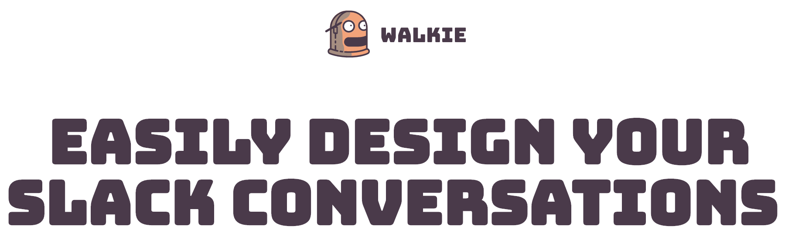

Walkiebot is the premier solution for prototyping conversational flows, and visualising what a message will look like in [Slack](https://api.slack.com/best-practices/storyboarding) - it features a WYSIWYG editor for creating and editing messages

## Table of Content

- [Quickstart](#quickstart)
- [Production](#production)
  - [Heroku](#heroku)
  - [Docker](#docker)
- [Configuration](#configuration)
- [Screenshots](#screenshots)
- [Contributors](#contributors)

Some articles we wrote about Walkie:
* https://blog.founders.as/walkie-bloggie-postie-ff1938668605
* https://blog.founders.as/walkie-announcement-sign-in-with-slack-and-more-56427dad9059
* https://blog.founders.as/walkie-two-point-ooh-snap-5cef2bb8f274

# Quickstart

* Install [nodejs](https://nodejs.org/en/)
* Install [docker](https://www.docker.com/)

```bash
# Clone this repo
$ git clone git@github.com:FoundersAS/walkiebot.git
# Install packagages
$ yarn
# Run Walkie! (For the first run docker will pull the mongodb image)
$ yarn dev
```

Now visit [http://localhost:8005](http://localhost:8005) for some 🤖💙!

### Note:

Walkie uses mongodb as the database, it's the only outside requirement to run walkie in any environment.
In any setup explained here mongodb is included.
When developing locally with `yarn dev` docker-compose is used to manage the mongodb, on heroku a free mlabs mongodb addon is provisioned automatically.

In case you want to use authentication you will need to set up a slack application, you can do that here: [api.slack.com/apps](https://api.slack.com/apps) - JWT is used for authorisation so you'll need to generate a keypair and add the keys as environment variables (more on that in [Configuration](#Configuration)), but here is a [quick link with instructions](https://gist.github.com/ygotthilf/baa58da5c3dd1f69fae9)

# Production

## Heroku

<a target="_blank" href="https://heroku.com/deploy?template=https://github.com/FoundersAS/walkiebot">
  
</a>

These environment variables are required with heroku:<br />
(the setup wizard will ask you to fill them out as well)

* `NPM_CONFIG_PRODUCTION` when deploying to heroku this should be false so `devDepencies` are installed
* `HEROKU_APP_NAME` used only on heroku, it should be the same value as your heroku app name

## Docker

You can use `docker-compose`, the `docker-compose.yml` file is set up to build Walkie from the `Dockerfile` in the project root.

# Configuration

If there are some of these variables you do not want to be checked into your repo, then put them in a file called `local.json`:

```json
{
  "JWT_SECRET": "...",
  "SLACK_CLIENT_SECRET": "..."
}
```

These are the available environment variables walkie uses:

* `NGROK_SUBDOMAIN` only required locally with slack login enabled
* `MONGODB_URI` a mongodb uri
* `JWT_PUBLIC` You can generate a keypair using the instructions here: https://gist.github.com/ygotthilf/baa58da5c3dd1f69fae9
* `JWT_SECRET` For local development keep these files in your `local.json` file
* `APP_HOST` used only locally and for generating some redirection urls related to logging in with slack
* `SLACK_CLIENT_ID` if this is not provided the sign in with slack button will not be shown in walkie
* `SLACK_CLIENT_SECRET`
* `SLACK_LOGIN_REDIRECT_URL`

# Screenshots

<a href="./_docs/screenshots/add-users.png">
  
</a>

Add as many users as you like to your stories for maximum interaction (and possibly confusion!)

<a href="./_docs/screenshots/sidebar.png">
  
</a>

The sidebar visualises how your conversation is structured and allows you to create new messages in reaction to others

<a href="./_docs/screenshots/message-builder.png">
  
</a>

The message builder help you design Slack messages with a live preview

<a href="./_docs/screenshots/export-to-json.png">
  
</a>

Export any message to a valid Slack message payload

# Contributors

Thank you to all of you who are and have been using and helping improve Walkie!

* [@madshensel](https://github.com/madshensel)
* [@joshuakarjala](https://github.com/joshuakarjala)
* [@freeall](https://github.com/freeall)
* [@sorribas](https://github.com/sorribas)
* [@dinoshauer](https://github.com/dinoshauer)


# License

ISC
